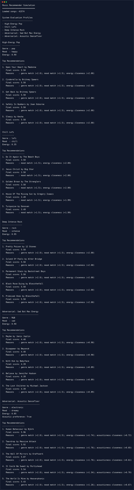
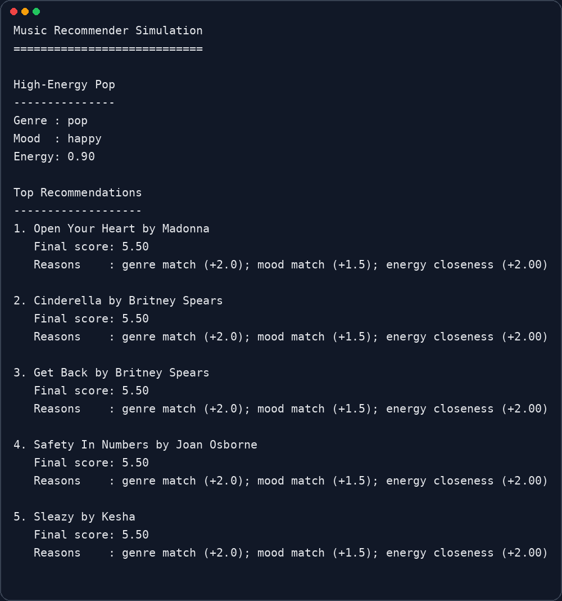
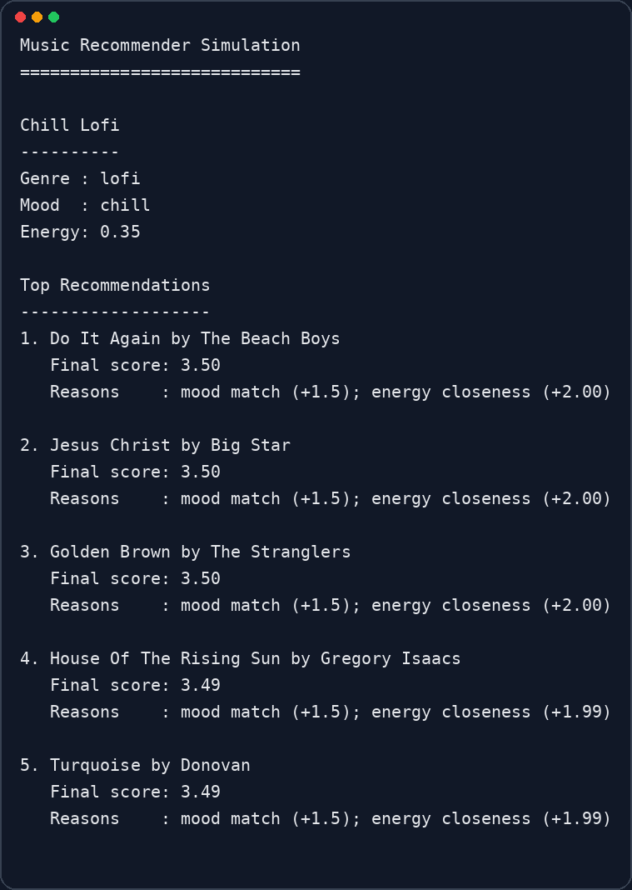
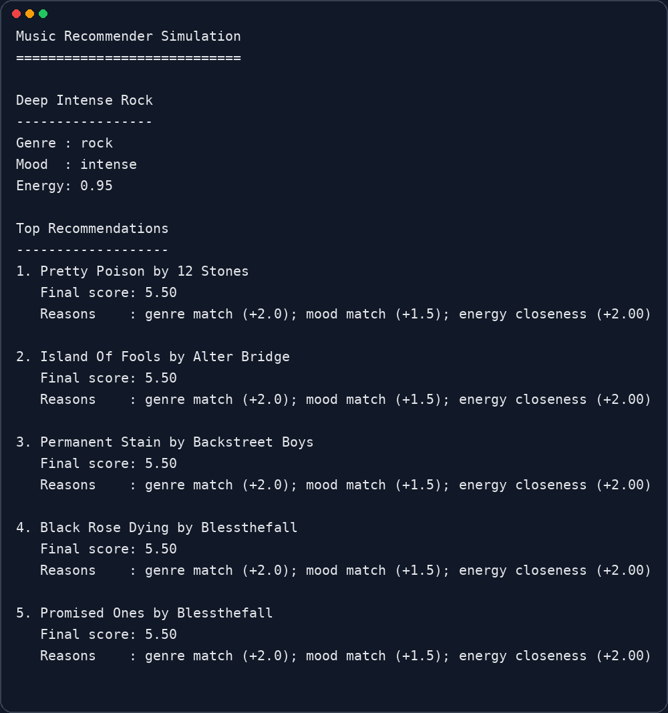
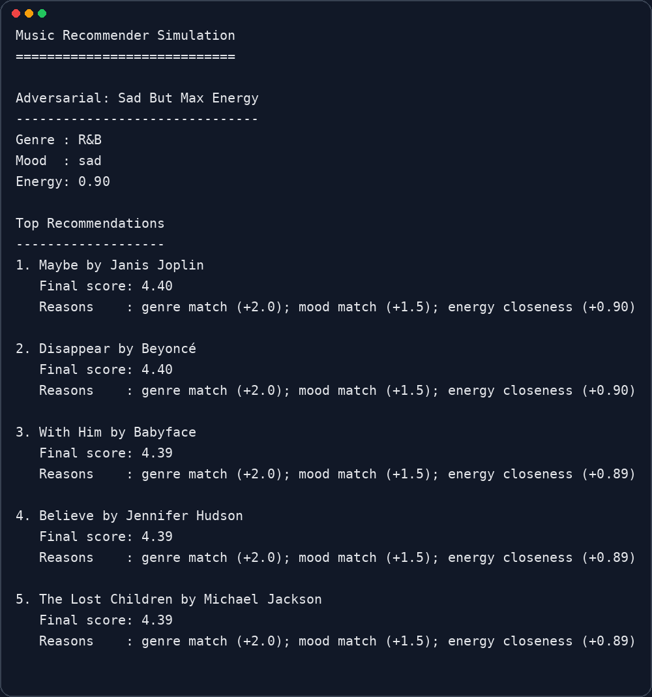
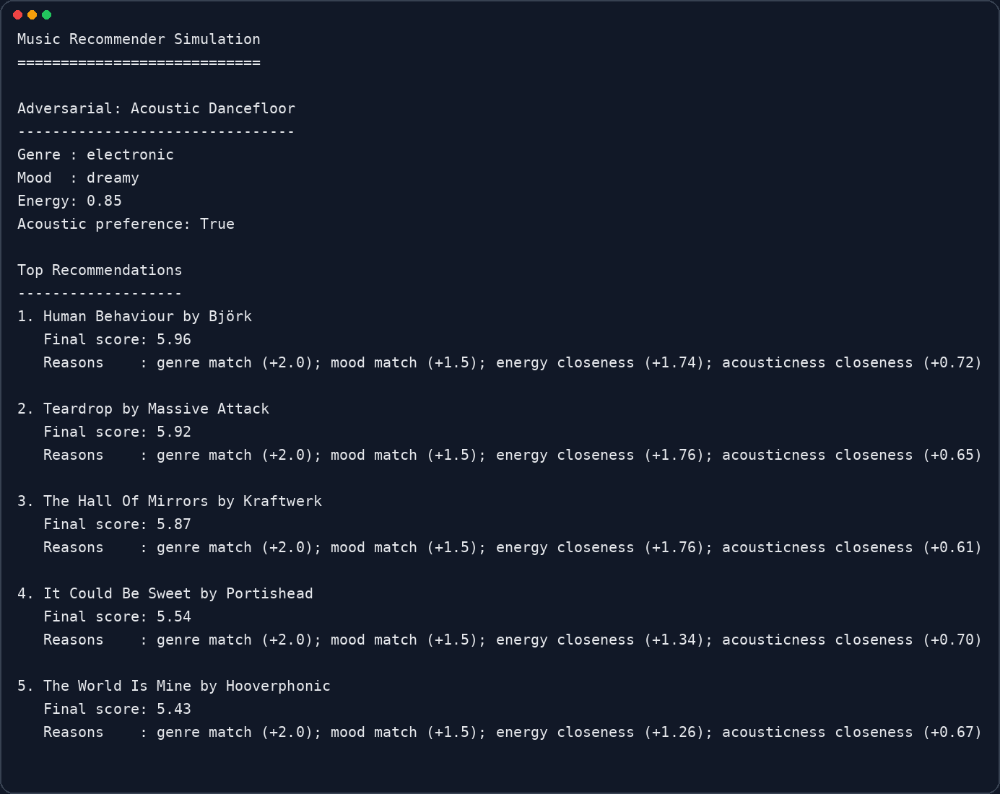

# 🎵 Music Recommender Simulation

## Project Summary

This project builds a simple content-based music recommender. It scores each song against a user taste profile and returns the top matches with short explanations. The goal is not to copy Spotify or Apple Music, but to show how a small AI-style ranking system can feel useful while still having clear limitations and biases.

The current version uses a large adapted dataset of real songs. I converted `songs_v2.csv` into `data/songs_v2_adapted.csv` so the app could use a consistent schema with features like genre, mood, energy, tempo, valence, danceability, and acousticness.

---

## How The System Works

This recommender is a content-based system. It does not learn from user history or other listeners. Instead, it compares each song to the user's stated preferences and assigns a score.

### Song Features

Each song uses these fields:

- `id`
- `title`
- `artist`
- `genre`
- `mood`
- `energy`
- `tempo_bpm`
- `valence`
- `danceability`
- `acousticness`

### User Profile Features

Each user profile can include:

- `favorite_genre`
- `favorite_mood`
- `target_energy`
- `likes_acoustic`

### Scoring Logic

The score rewards:

- genre match: `+2.0`
- mood match: `+1.5`
- energy closeness: up to `+2.0`
- tempo closeness: up to `+1.0`
- valence closeness: up to `+0.75`
- danceability closeness: up to `+0.75`
- acousticness closeness: up to `+1.0`

The recommender then sorts all songs from highest score to lowest score and returns the top `k` results. It also explains why each song ranked where it did.

---

## Data Used

The system now uses `data/songs_v2_adapted.csv`, which contains **41,574 songs**.

Some important notes about the adapted dataset:

- it was converted from `songs_v2.csv`
- `mood` was inferred from audio-style features
- the catalog is not balanced across genres
- the biggest genres are `rock` and `metal`
- there are relatively few songs labeled `lofi`

Most common genres in the adapted file:

- `rock`: 13,809
- `metal`: 8,110
- `indie`: 4,647
- `hip-hop`: 2,903
- `folk`: 2,536
- `R&B`: 1,885
- `electronic`: 1,855
- `country`: 1,456

Most common moods:

- `chill`: 14,050
- `intense`: 10,462
- `happy`: 4,920
- `uplifting`: 4,224
- `relaxed`: 3,173

---

## Getting Started

### Setup

1. Create a virtual environment if you want:

```bash
python -m venv .venv
source .venv/bin/activate
```

2. Install dependencies:

```bash
pip install -r requirements.txt
```

3. Run the recommender:

```bash
python -m src.main
```

### Running Tests

```bash
pytest
```

---

## Sample Output

Running `python -m src.main` prints the evaluation profiles and the top 5 recommendations for each one.



---

## Stress Test with Diverse Profiles

I tested the recommender with five profiles in `src/main.py`:

- `High-Energy Pop`
- `Chill Lofi`
- `Deep Intense Rock`
- `Adversarial: Sad But Max Energy`
- `Adversarial: Acoustic Dancefloor`

These profiles were chosen to test both normal behavior and edge cases. The adversarial profiles were designed to see whether the scoring logic could be pulled in conflicting directions.

### High-Energy Pop



### Chill Lofi



### Deep Intense Rock



### Adversarial: Sad But Max Energy



### Adversarial: Acoustic Dancefloor



---

## Experiments and Observations

A few patterns showed up during testing:

- `High-Energy Pop` worked well because the dataset has many pop songs with happy mood and high energy.
- `Deep Intense Rock` also worked well for the same reason: the genre is common in the data and the target mood and energy align.
- `Chill Lofi` was weaker than expected because the dataset does not contain many explicit `lofi` songs, so the system relied mostly on `chill` mood and low energy instead of genre.
- `Sad But Max Energy` showed a useful bias: genre and mood matches stayed strong even when the energy target was a poor fit.
- `Acoustic Dancefloor` showed that adding acoustic preference can shift results, but only when enough songs in that genre family have meaningful acousticness values.

---

## Limitations and Risks

This recommender has several clear limits:

- it depends heavily on the labels already in the dataset
- it can create a filter bubble around common genres
- rare genres get weaker results because there are fewer strong matches
- inferred mood labels are not perfect
- the scoring system is simple and does not represent real listening behavior

The biggest issue I found is dataset imbalance. Because the catalog is heavily weighted toward rock and metal, some profiles get more accurate recommendations than others. This means the system is not equally fair to every kind of listener.

---

## Reflection

The biggest lesson from this project was that the data matters as much as the scoring logic. A simple scoring rule can feel smart when the dataset has good matches, but it can also feel biased very quickly when the catalog is uneven. The `Chill Lofi` profile made that especially obvious.

AI tools helped me speed up coding, formatting, and evaluation ideas, but I still had to verify the outputs carefully. The suggestions were useful for structure and iteration, but the real behavior of the recommender only became clear after I ran the profiles and checked the results myself.

For the full write-up, see:

- [model_card.md](model_card.md)
- [reflection.md](reflection.md)
